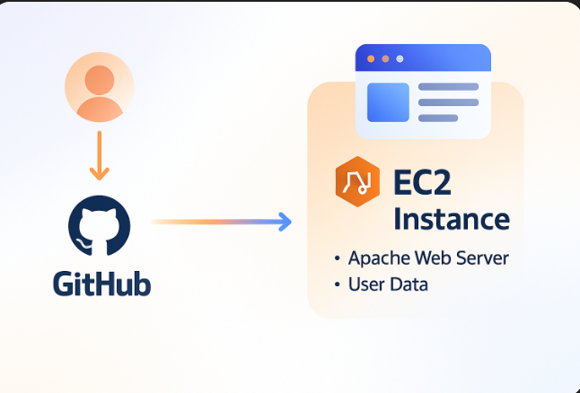

# 🚀 EC2-Apache-WebServer Deployment Project

This project demonstrates how to deploy a static website hosted on an Apache Web Server using an Amazon EC2 instance. The source code for the website is pulled directly from this GitHub repository.

##  Tech Stack

- Amazon EC2  
- Apache HTTP Server  
- GitHub  
- User Data Script (for automation)  
- Amazon Linux 2

  
## 02. Network Architecture




##  Steps to Reproduce

1. **Launch EC2**: Amazon Linux 2, t2.micro (Free Tier), open ports 22 & 80.
2. **User Data Script**:

```bash
#!/bin/bash
yum update -y
yum install -y httpd git
systemctl start httpd
systemctl enable httpd
cd /var/www/html
git clone https://github.com/your-username/EC2-Apache-WebServer-Deployment.git .
```

## Output
1. **Access site**: http://<your-ec2-public-ip>


##  Files
- Architecture.png
- index.html  
- README.md

---
